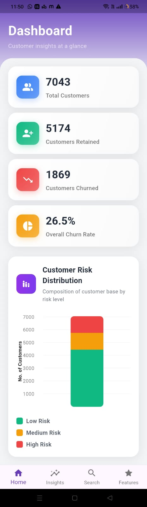
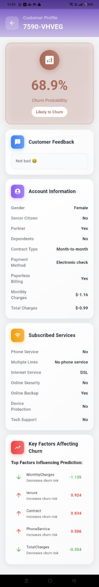

# 📊 Customer Churn Prediction --- ML + Flutter UI
|splashscreen | Dashboard |Insights |
|------------|---------------|----------------|
|  |  | |
A complete end-to-end project that predicts customer churn using
**Machine Learning (Python)** and visualizes the results through a
**Flutter-based UI**.\
This system helps businesses identify at-risk customers, improve
retention, and understand churn drivers through SHAP explainability.

## 🚀 Project Overview

This project integrates:

-   **Python Machine Learning Pipeline**
-   **Flutter Frontend Application**

## 📁 Repository Structure

    ├── notebook/
    │   ├── data_preprocess.ipynb
    │   ├── generate_full_predictions.ipynb
    │   ├── all_customers_predictions.csv
    │
    ├── models/
    │   └── best_xgb_model.pkl
    │
    ├── metrics/
    │   └── shap_all_customers.csv
    │
    ├── flutter_app/
    │   ├── lib/
    │   ├── assets/
    │   ├── pubspec.yaml
    │
    └── README.md

## 🧠 Machine Learning Pipeline (Python)

-   Data preprocessing\
-   Feature engineering\
-   Model training (XGBoost, SVM, RF, LR)\
-   SHAP explainability\
-   Batch predictions export

## 📱 Flutter UI

-   Clean responsive interface\
-   Displays churn predictions\
-   Customer-level SHAP insights\
-   Offline-ready using CSV/JSON\
-   Extendable to API backend

## 📦 Running the Project

### Python ML

    pip install -r requirements.txt
    jupyter notebook notebook/data_preprocess.ipynb
    jupyter notebook notebook/generate_full_predictions.ipynb

### Flutter UI

    flutter pub get
    flutter run

Place exported CSV files into Flutter app assets.

## 📄 License

MIT License.
