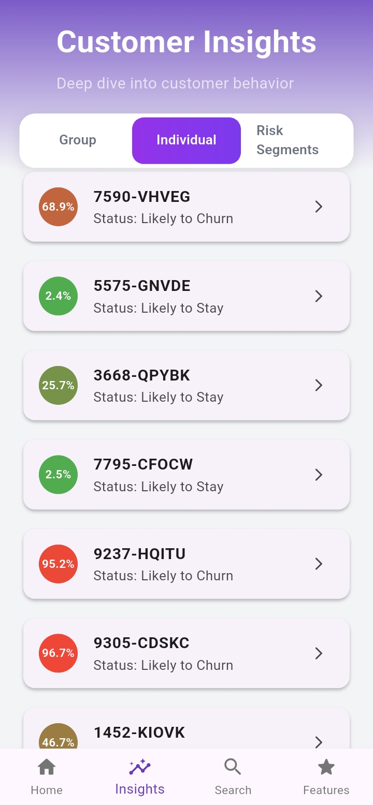
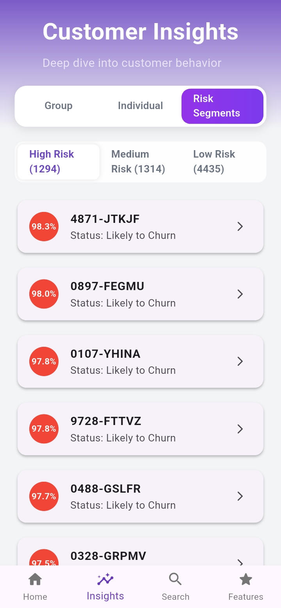

# Customer Churn Prediction

A complete end-to-end system that predicts customer churn using Machine Learning (Python) and visualizes the results through a Flutter-based mobile application. This project helps businesses identify at-risk customers, improve retention strategies, and understand churn drivers through SHAP explainability.

---

## Screenshots

| Splash Screen | Dashboard Overview | Customer Search |
|---|---|---|
|  |  |  |

| Churn Insights | Feature Breakdown | Risk Distribution |
|---|---|---|
|  |  |  |

---

## Project Overview

This project integrates a Python-based machine learning pipeline with a Flutter frontend to deliver an offline-ready churn prediction dashboard. The ML pipeline handles data preprocessing, model training, and SHAP-based explainability, while the Flutter app presents predictions and insights in a clean, responsive interface.

---

## Repository Structure

```
├── notebook/
│   ├── data_preprocess.ipynb
│   ├── generate_full_predictions.ipynb
│   └── all_customers_predictions.csv
│
├── models/
│   └── best_xgb_model.pkl
│
├── metrics/
│   └── shap_all_customers.csv
│
├── flutter/
│   ├── lib/
│   ├── assets/
│   └── pubspec.yaml
│
└── README.md
```

---

## Machine Learning Pipeline

- Data preprocessing and feature engineering
- Model training and evaluation — XGBoost, SVM, Random Forest, Logistic Regression
- SHAP-based explainability for individual predictions
- Batch prediction export to CSV for use in the Flutter app

---

## Flutter Application

- Responsive mobile UI built with Flutter
- Displays churn predictions at the customer level
- SHAP-driven insights per customer
- Offline-ready — powered by local CSV/JSON assets
- Extendable to a live API backend

---

## Getting Started

### Machine Learning

```bash
pip install -r requirements.txt
jupyter notebook notebook/data_preprocess.ipynb
jupyter notebook notebook/generate_full_predictions.ipynb
```

### Flutter App

```bash
flutter pub get
flutter run
```

Place the exported CSV files into the `flutter/assets/` directory before running.

---

## License

MIT License
